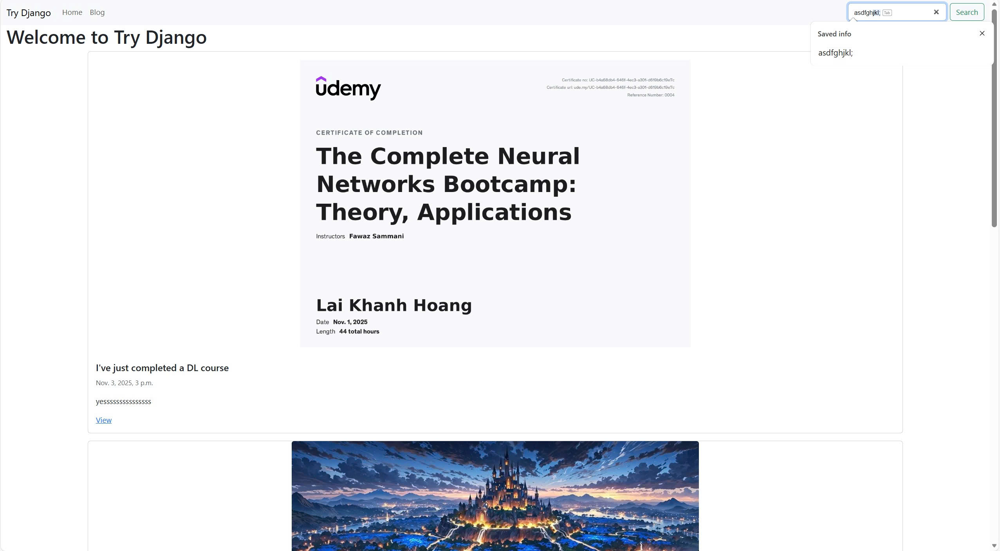
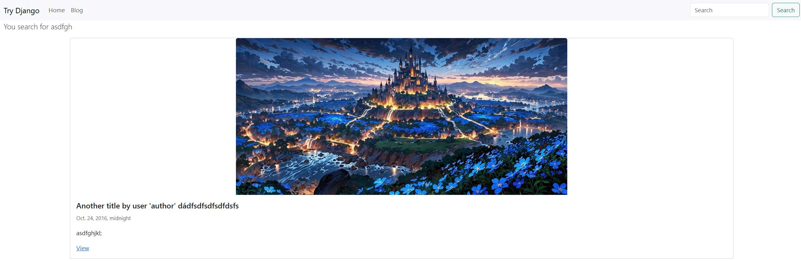
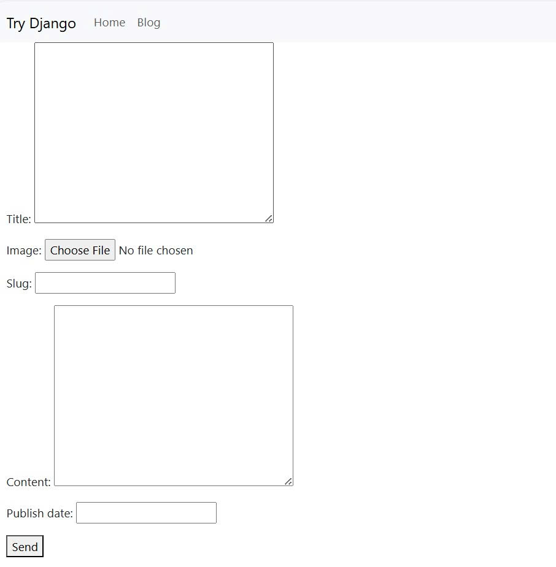
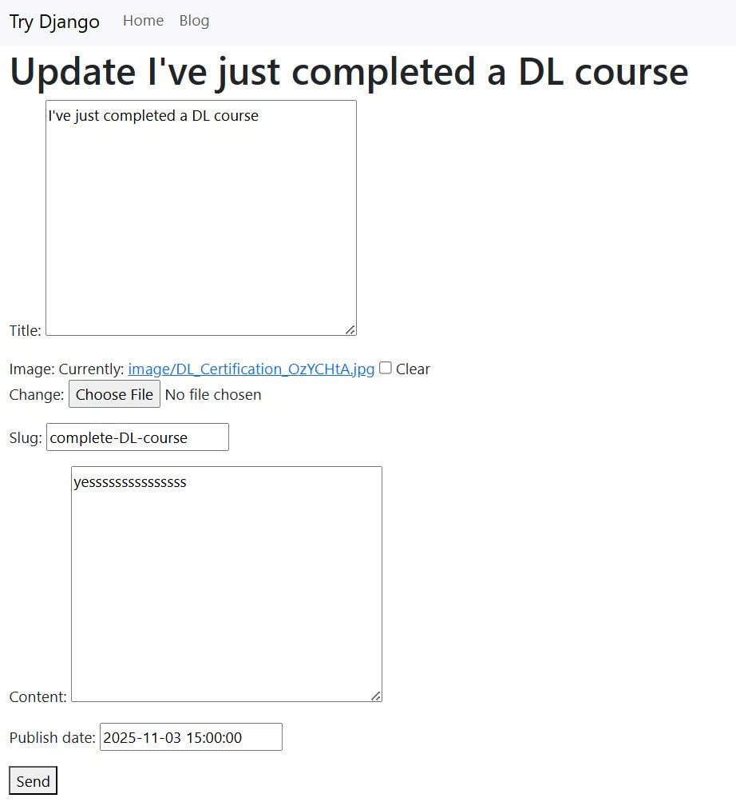
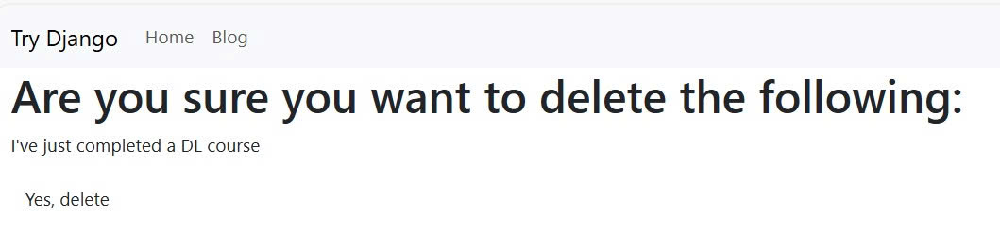

This is a website I created following the instructor's guidance during a course I took on Udemy.

  

**Tech Stack**: Python (Django), HTML, CSS, JavaScript

**Key Features**

1. **For Users**
- Blog: Allows users to view all posts, which include a title, content, and an optional image, posted by staff.

  

- Search: Allows users to search for posts by tag, title, content, etc.

  

2. **For Staff**
- Authorization & Authentication: User permissions management using Django’s built-in templates.
- Basic CRUD: Allows staff to create, read, update, and delete posts.
  - Create
    

      
    

  - Update
    

      
    

  - Delete
    

      
    

